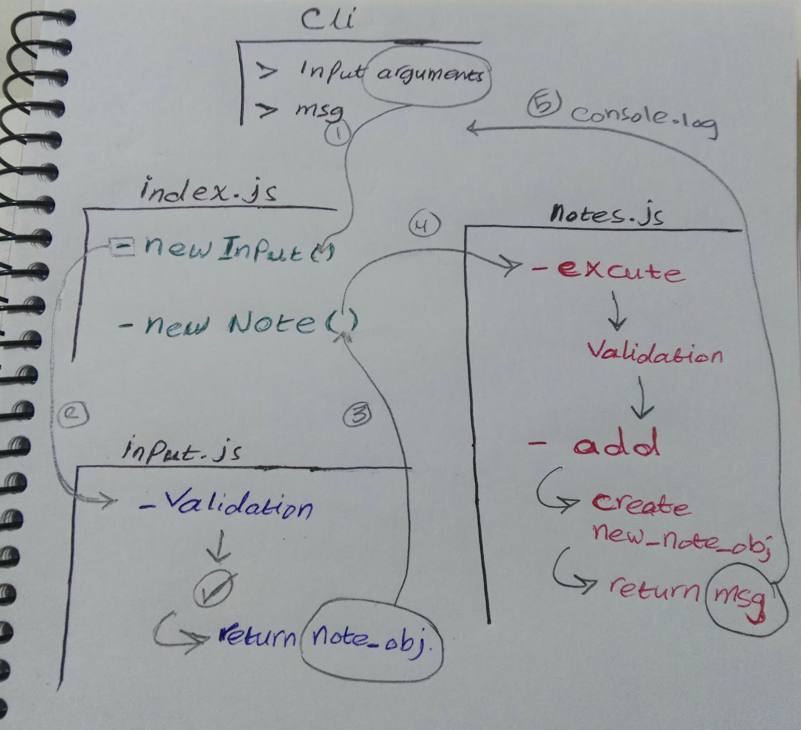

# LAB 01 - Class 01

## Project: Notesy

### Author: Bushra Bilal

### Description: 
**A command-line (Terminal-based) note taking application.**

### Links and Resources

- [submission PR](https://github.com/bushra-401-advanced-javascript/notes/pull/1)

### Setup

#### How to use the application 

- clone the app repository
- install `minimist` library using `npm`
  - `npm i minimist`
- you can start using the application directly from your terminal
- to add a note:
  - `node index.js --add/-a "note_text"`

#### UML

